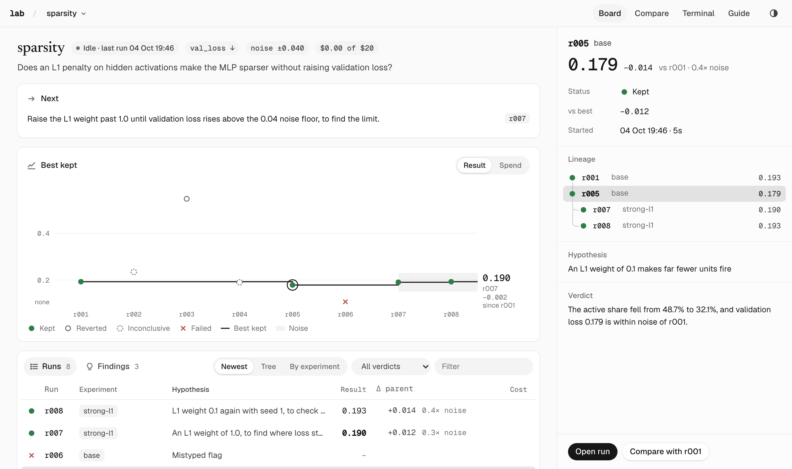

# lab

Run any command, record every run, compare honestly. For ML research done by people, coding agents, or both.

<picture>
  <source media="(prefers-color-scheme: dark)" srcset="docs/board-dark.png">
  
</picture>

lab doesn't own your code. It wraps a command (`lab run -- python train.py`) and keeps a record of it: the code
that ran, its output, metrics, figures, cost, and your verdict. Results are compared only against runs on the
same eval, in units of the noise floor you measured.

## Install

```bash
uv tool install git+https://github.com/esceptico/lab
lab init ~/research && cd ~/research
```

`lab init` makes a lab: a folder with `campaigns/`, a shared `lib/`, and `AGENTS.md`, `CLAUDE.md` and a skill so coding
agents know how to use it. `lab doctor` checks which tools and keys are ready.

## Quickstart

```bash
lab new campaign sparsity --metric val_loss --goal min --budget 20 \
    --question "Does an L1 penalty on activations make the MLP sparser without raising loss?"
cd campaigns/sparsity
lab new exp base --template modal-custom && cd experiments/base

lab run -H "Baseline" -P "val_loss around 0.2" -- python train.py
lab verdict 1 keep -m "Baseline: val_loss 0.193, 48.7% of units active."
lab                     # the campaign at a glance
lab board --open        # the page above
```

In your code (they do nothing outside `lab run`):

```python
from lab import log, summary, cost, artifact, fig

log(step=step, loss=loss)               # curves
summary(val_loss=0.193)                 # what the run is judged by
cost(4.20, "provider-reported usage")   # money a service billed
artifact("samples.txt", "Generations at the last step")
fig.line({"active": usage}, x_label="unit", title="Hidden-unit usage")
```

## Scenarios

**Measure noise before trusting a delta.** Repeat the baseline with another seed, then set the floor:

```bash
lab run -H "Baseline, seed 1" -- python train.py --seed 1
echo 'noise_floor = 0.04' >> ../../campaign.toml
```

Every change is then shown in units of it: under 1× is within noise, 2× or more is likely real.

**Try an idea, then judge it.**

```bash
lab run -H "L1 weight 0.1 makes fewer units fire" -P "active < 40%, loss within noise" -- python train.py --sparsity 0.1
lab show 5                 # result, change vs parent, lineage, files, code change
lab compare 5 1            # two runs side by side: metrics, attributes, command and code diff
lab verdict 5 keep -m "Active share 48.7% → 32.1%; val_loss within noise."
```

`keep` makes the run the baseline. The other verdicts are `revert`, `inconclusive` and `failed`.

**Branch from a run.** `lab new exp strong-l1 --from r005` copies the exact code that run used.

**Long runs.** `lab run -d ...` runs in the background and survives a closed terminal or agent session; `lab ls`
shows when it ends.

**Run on a GPU.** Your experiment folder, `locked/` and `lib/` are shipped; metrics, figures and artifacts come back
into the run:

```bash
lab run -H "..." -- modal run -m lab.modal_app --script train.py --args "--sparsity 0.1" --gpu A10
lab run -H "..." -- python -m lab.ssh_app --host root@203.0.113.7 --port 22042 --script train.py
```

**The eval changed.** Files in `locked/` (data prep, eval) are hashed on every run. After an edit, new runs are flagged
and not compared with old ones until you accept it, which starts a new comparison epoch:

```bash
lab lock --accept "Dev split rebuilt without duplicates"
```

**Track spend.** A campaign stops starting runs once recorded spend reaches its budget. Only real amounts count:
`cost()` from your code, or a bill added later with `lab cost 7 12.40 -m "RunPod invoice"`.

**Work with an agent.** Inside a lab, Claude Code, Codex and other agents pick up `AGENTS.md`/`CLAUDE.md` and the
`lab` skill. Piped output is plain text with tab-separated tables, and every read command takes `--json`.
After upgrading lab, run `lab sync` to refresh those files.

**Share a result.** `lab board --open` covers every campaign. `lab report sparsity --open` turns `report.md` (or
`findings.md`) into a page where run ids show their evidence and figures switch between runs.

**Models and benchmarks.**

```bash
lab fetch model Qwen/Qwen3-0.6B             # pinned to a commit; revision, license, size go in pins.json
lab bench Qwen/Qwen3-0.6B --tasks mmlu_pro  # lm-evaluation-harness as a run, with ECE and Brier
```

## Templates

`lab new exp <name> --template <t>`:

| template | runs on | for |
|---|---|---|
| `modal-custom` | local or Modal | any PyTorch; custom architectures and losses |
| `tinker-sft` | Tinker | LoRA SFT on hosted models, custom losses over logprobs |
| `prime-rl` | Prime Intellect | RL or SFT distillation on Hub environments |
| `interp` | local or Modal | Jacobian subspaces between layers, with random and SAE controls |

`lab smoke` runs them on tiny configs; `--live` also checks the services.

## Layout

```
lab.toml                    marks the lab root
lib/                        shared code, on every run's PYTHONPATH
campaigns/<name>/
  campaign.toml             question, metric, goal, budget, noise_floor, target
  findings.md               Next, and what we believe now, citing runs
  locked/                   data prep and eval: hashed, never compared across changes
  experiments/<exp>/        your code
  runs/<id>/                run.json, metrics.jsonl, stdout.log, code/, figures/, artifacts/
```

Records are plain JSON and JSONL. `lab --help` lists every command; the full reference (every flag, `lab.fig`, runners,
reports) is in [`src/lab/skill/references/`](src/lab/skill/references).

## Development

```bash
git clone https://github.com/esceptico/lab && cd lab
uv tool install -e .                        # lab from this checkout
uv run pytest                               # -m "not network" skips Hugging Face downloads
node --test tests/web/*.test.mjs
uv run ruff check && uv run ruff format --check
uv run python scripts/skill_reference.py    # after changing the CLI or lab.fig
uv run --with playwright scripts/board_check.py <lab>   # click through the board
```
